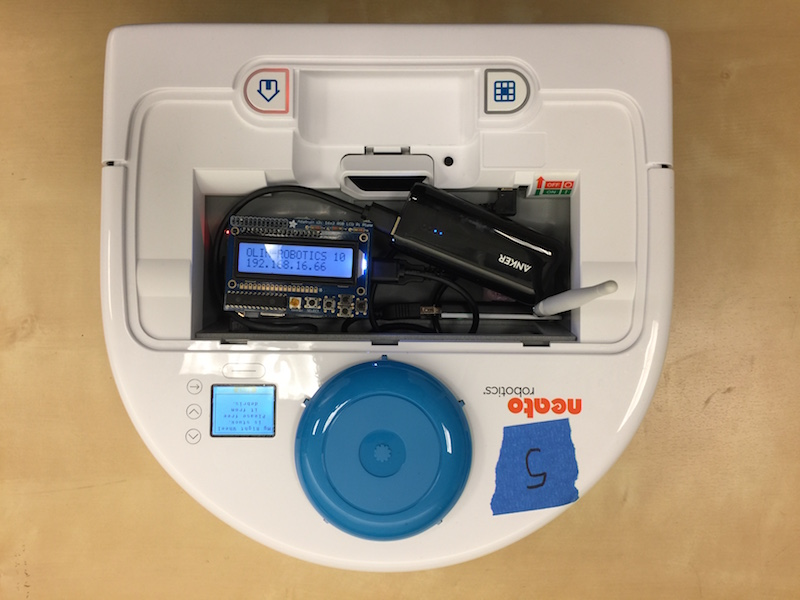
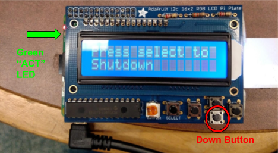
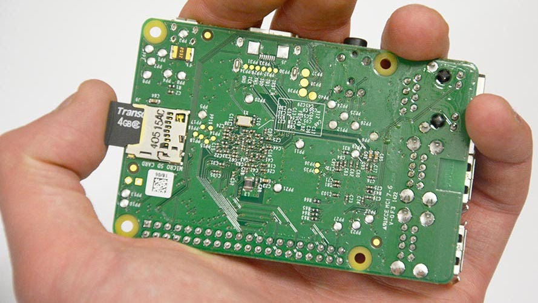
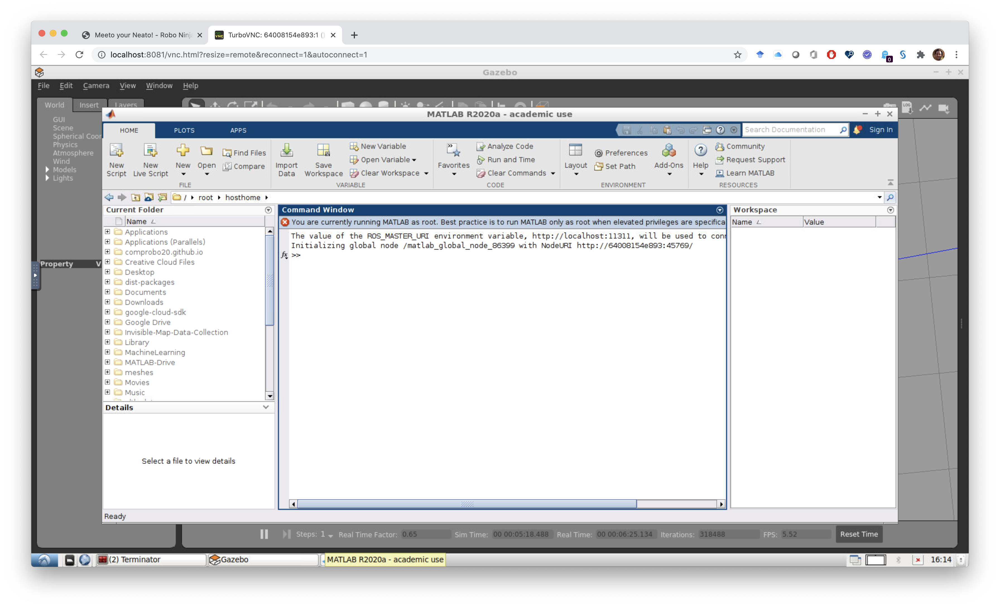

## Purpose of this How-to

This document will help you to get you up and running with your Neato robot.  After following these instructions you will be able to connect to your robot, examine its sensor data, and drive it around.


## Overview

In this module we will be programming the Neato BotVac. The Neato is a powerful, low cost robot platform that we have customized for QEA (it's also technically a vacuum cleaner, but we'll be ignoring that for this module!). We have engineered the platform to abstract away a lot of the frustrating bits, allowing you to focus on learning the really fun robotics, physics, math, and computing content.

<p align="center">

</p>

The robots have each been outfitted with a Raspberry Pi. The Raspberry Pi is a low cost, Linux computer that will serve as a bridge between your laptop and the robot. To use the robot you will initiate a connection from your laptop (in MATLAB), via the Olin network, to the Raspberry Pi.  Once the connection has been made, the Raspberry Pi will start talking to the robot.  All sensor data will then be streamed from the Raspberry Pi to your laptop over Olin's wireless network. Your laptop will process this sensor data and then send motor commands to the robot over the same network.  In this way, all important computation will be done on your laptop.  This architecture simplifies the sharing of robots and makes debugging and editing code as easy as possible.

Since you are not modifying the code running on the Raspberry Pi, each robot will function identically (i.e. there is no software you need to modify on the robot). However, due to variance in manufacturing and handling over the years, each robot may have its own hardware idiosyncrocies.


## Connecting to the Physical Neatos

### Step 0: Make sure you have Matlab installed. 

We used Matlab last semester, but just in case...

### Step 1: Grab a USB battery pack for the raspberry Pi

Checklist before performing this step:

1. The battery indicator light should be at least level 2 (preferably full)

### Step 2: Choose your Neato

Checklist before performing this step:

1. Make sure the Neato's batteries are charged.  To test this, pull the Neato away from its charging station and for the newer Neato's hit the button near the front bumper of the Neato that has the home icon on it. For the older Neato's hit the larger orange power button.  The display should illuminate revealing a battery capacity indicator.  Sometimes you will have to click the button below the display to dismiss any errors that show up on the Neato’s screen before the battery level is displayed.

### Step 3: Connect the USB battery pack to the Raspberry Pi's USB cable.

It should take about 1 minute for the robot to be ready to use (see step 4 for a final checklist).

### Step 4: Connecting to the Neato from Your Laptop

Checklist before performing this step:

1. Raspberry pi display backlight is illuminated and not flashing on and off (see troubleshooting section for what to do if this is not the case)
2. Raspberry pi display shows that the Neato is connected to the OLIN-ROBOTICS network and has an IP address assigned to it.
3. Raspberry pi display shows that the signal strength of the Neato's connection is at least 70 (the max is 99) for the wifi dongles with antennas, and at least 50 (max is 65) for the dongles without antennas.  Note: If the signal strength is too low, see troubleshooting section for more information.
4. Your laptop is either connected to the ethernet or the OLIN wifi network (Note: this will not work if you are on OLIN-GUEST).

Start up MATLAB on your computer and run the following command.

***Note: replace the part of the command below that says 192.168.16.68 with the IP address of your robot that is shown on the Raspberry Pi's LCD display.***

```matlab
>> qeasim start physical 192.168.16.68
```

You can verify this worked because the robot will start making a quiet whirring sound and the laser (visible from the side) will start rotating. You should also see in the command window that you are "connected".

When you are ready to disconnect from the robot, run the following command in the MATLAB window you used to connect to your robot.

```matlab
>> qeasim stop
```

### Step 5: Shutting Down the Raspberry Pi

When you are done working with the robot it is important to properly shutdown the raspberry pi. DO NOT just unplug the battery. To shutdown the pi, push the "down" button until you see the message "Press select to Shutdown". Press select and wait for the green "ACT" LED on the left side of the Pi to flash steadily ten times then stay off. It is then safe to unplug the battery.

<p style="text-align: center;">

</p>

### Step 6: Connect through MATLAB

The instructions for working with the physical Neato should be identical to the simulated Neato.  Please see the sections on [Connecting to the Simulated Robot](#connecting-to-the-simulated-robot) and [Programming Your Robot](#programming-your-robot) for details.

## Troubleshooting Your Neato

*Symptom:* Both the red and green LEDs on the raspberry pi are illuminated and not flashing.

*Potential Cause:* the Pi was unable to boot from its SD card.

<ul>

<li>Solution 1: the first thing to check is that the Raspberry Pi's SD card is fully inserted into the Raspberry Pi.  See the image below for the location of the SD card.  You will know it is fully inserted if you push on the card and it clicks into place.

<p align="center">

</p>
</li>
<li>Solution 2: if the card is fully inserted, the SD card may have become corrupted (possibly because some people didn't properly shutdown the Raspberry Pi!).  Please send David (dshuman@olin.edu) an e-mail and tell him which robot is having the problem.  He'll fix it ASAP, but in the meantime just use another robot.</li>
</ul>

*Symptom:* the raspberry Pi display's backlight is flashing on and off.

*Potential Cause:* the Pi cannot connect to the robot via the USB cable.

* Solution: sometimes the Neato will turn off due to inactivity.  Press button near the front of the Neato’s bumper labeled with the home icon to wake your Neato up.  If that doesn't work, shutdown and then reboot the Pi.  If none of this works, the robot battery might be dead.  Try recharging the robot.  While the robot is recharging, switch to another robot.


### *Symptom:* the Wifi signal strength indicator on the Raspberry Pi is below 60 even though you are right near an access point.

*Problem:* The Pi has connected to an access point that is not the closest one (this will sometimes happen).

* Solution: Assuming the Pi display is at the screen showing the IP address, press right to enter the network setup menu.  OLIN-ROBOTICS should be highlighted with an asterisk.  Press right again to reconnect the Pi to the Wifi.  If it doesn't work the first time, try one more time.  If it doesn't work then, switch to a new robot.


### Activating MATLAB

The first time you run the simulator you will see need to activate MATLAB.  ***This is a one-time step***.

In the MathWorks Software Activation window (if it is not on top, you can bring it to the front using the toolbar at the bottom of the simulator window), perform the following steps.

1.  Make sure to select "Activate automatically using the Internet" and click "next"."
2.  Select "Login with your MathWorks Account", enter your email address and password, and click "next".
3.  Select MATLAB (Individual) for license type and click "next".
4.  Under "Login Name" type "root" and click next (***this is super important!***).
5.  Click the "Confirm" button.
6.  Click "Finish"

If all went well, MATLAB should launch in the simulator window and your screen will look like this.




The next time you run the simulator, you will not have to go through this process.
