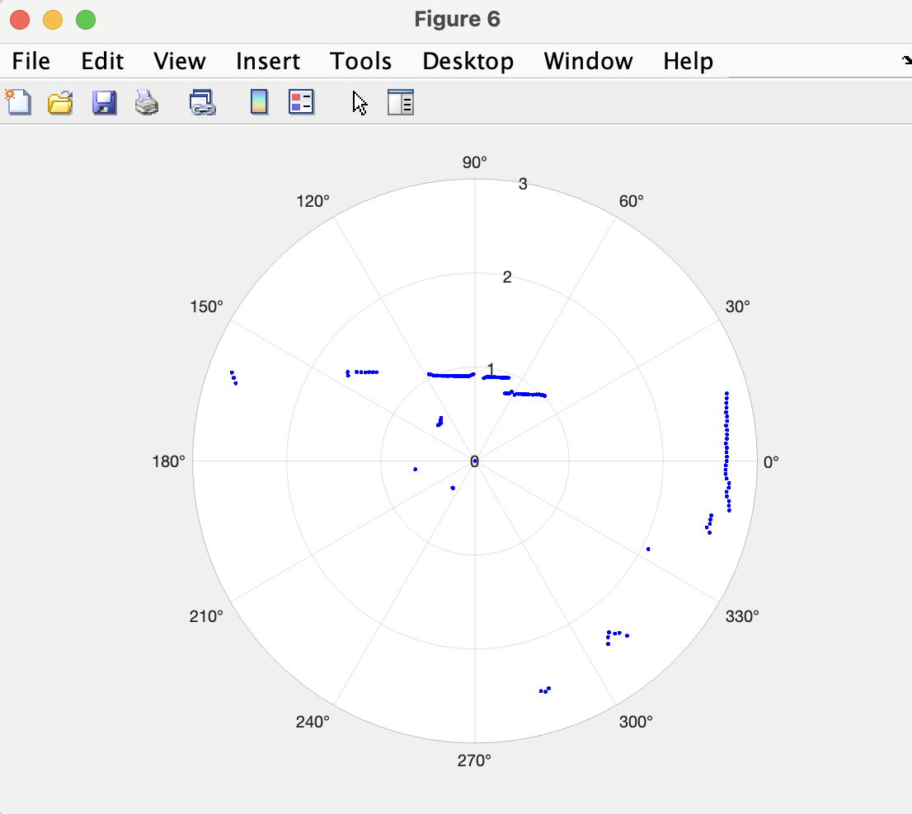

## Purpose of this How-to

This document will help you to get you up and running with your Neato robot.  After following these instructions you will be able to connect to your robot, examine its sensor data, and drive it around.


## Overview

In this module we will be programming the Neato BotVac. The Neato is a powerful, low cost robot platform that we have customized for QEA (it's also technically a vacuum cleaner, but we'll be ignoring that for this module!). We have engineered the platform to abstract away a lot of the frustrating bits, allowing you to focus on learning the really fun robotics, physics, math, and computing content.

<p align="center">

</p>

The robots have each been outfitted with a Raspberry Pi. The Raspberry Pi is a low cost, Linux computer that will serve as a bridge between your laptop and the robot. To use the robot you will initiate a connection from your laptop (in MATLAB), via the Olin network, to the Raspberry Pi.  Once the connection has been made, the Raspberry Pi will start talking to the robot.  All sensor data will then be streamed from the Raspberry Pi to your laptop over Olin's wireless network. Your laptop will process this sensor data and then send motor commands to the robot over the same network.  In this way, all important computation will be done on your laptop.  This architecture simplifies the sharing of robots and makes debugging and editing code as easy as possible.

Since you are not modifying the code running on the Raspberry Pi, each robot will function identically (i.e. there is no software you need to modify on the robot). However, due to variance in manufacturing and handling over the years, each robot may have its own hardware idiosyncracies.


## One-Time Setup in MATLAB

You should only have to do the following steps once at the beginning of the semester.

### Step 1: Make sure you have MATLAB installed

We used MATLAB last semester, but just in case...do make sure you have the latest version up and running.

### Step 2: Install MATLAB Drive Connector

MATLAB Drive is a cloud storage solution built into the MATLAB environment. This is how we will be sharing code releases with you throughout the semester. It does not come standard in your MATLAB release, so you'll need to install it separately. You can find the download here:

[https://www.mathworks.com/products/matlab-drive.html?s_tid=AO_MLConnector#matlab-drive-connector](https://www.mathworks.com/products/matlab-drive.html?s_tid=AO_MLConnector#matlab-drive-connector)

If prompted for a username and password, use your standard Olin credentials. When you install this program, there will be a local folder in your file system called "MATLAB-Drive." All the files in that folder get synced to the cloud on the MATLAB site, similar to how it is done for Dropbox or Google Drive.

### Step 3: Add Neato files to your MATLAB Drive

Let's go ahead and get the first release of Neato code you'll be using in the class set up. Click on the following link:

[https://drive.mathworks.com/sharing/d43f55d4-77af-4fa8-aa7c-6abb36ad34e6](https://drive.mathworks.com/sharing/d43f55d4-77af-4fa8-aa7c-6abb36ad34e6)

Then click "Add to my Files" and then "Add Shortcut." Use your Olin credentials for the requested username and password.

> ***Note: you may need to re-visit this link in the semester if your MATLAB-Drive gets out of whack, or you want a fresh version of the latest release code. Consider bookmarking this page, or remember to come back here!***


### Step 4: Set and save path

To execute code in MATLAB, it needs to be on your "Path" when interacting with the terminal/Command Window. To add your MATLAB-Drive to your default path:

1. On the Home tab of MATLAB, to the right of the Layout button, there is a small icon with multiple folders for "Set Path." Click on that. 
2. Then click on "Add with subfolders..." and browse to and select the "MATLAB-Drive" from your files. 
3. Click on "Save" to make sure the path is saved. 

### Step 5: Check that the Neato files are in your path

In the Command Window, type 

```matlab
>> which neatov2
```

If you get a location of a file on your laptop, you have set the path correctly. If you get a message saying "'neatov2' not found," repeat the previous step again. Next, quit MATLAB, reopen it, and then repeat this step to make sure you saved the path correctly.

## The Neato Fleet and "Pit Cart"
In your studio there will be a Neato cart where fresh Neatos and battery packs will be stored for your use. There are also battery pack charging stations on both carts, under the "NeatoKart" signage.

<p align="center">

</p>

In addition to your Neato cart, there is a shared "Pit Cart" which is where Neatos or batteries that need attention by our "Pit Crew" (AKA teaching team) should be placed. The intent of the Pit Cart is to make sure your Neatos are always working up-to-snuff. If we don't know there is a problem, we can't fix it. And we also don't want you to spend time debugging the physical hardware. When putting something on the Pit Cart, please leave a note explaining the issue that you saw with the Neato or battery pack, so we can have a look.

<p align="center">

</p>


## Connecting to the Physical Neatos 
Before we can drive, we must set up the communications between your Laptop and the Raspberry Pi. 

### Step 1: Grab a USB battery pack for the Raspberry Pi

Checklist before performing this step:

1. The battery indicator light should be at least level 2 (preferably full)
2. If your battery indicator light is "suspicious" (e.g., flashes quickly on and off, won't turn on at all, provides erratic readings) _do not use this battery pack_ and place it on the "Pit Cart" for diagnosis by the teaching team.
3. If you find a battery that isn't charged all the way and isn't plugged in for charging, please plug it in.

### Step 2: Choose your Neato

Checklist before performing this step:

1. Make sure the Neato's batteries are charged.  To test this, pull the Neato away from its charging station and press the "Home" button located near the front right bumper of the Neato (and which has a house icon on it). The display should illuminate revealing a battery capacity indicator in the top left corner of the display. Sometimes you will have to click the button below the display to dismiss any errors that show up on the Neato’s screen before the battery level is displayed (e.g., the message "Please put my dirt bin back in" can just be dismissed by pressing "Okay").
    1. If the indicator is green, you are good to go.
    2. If the indicator is orange, or the Neato displays "My battery is low, please charge me." then you should replace the Neato on the charger (see detailed instructions below) and look for another.
    3. If the Neato displays a message like "Battery Error" or "Please press DOWN on the power switch" place this Neato on the "Pit Cart" for diagnosis by the teaching team.
2. Make sure the Neato has the capabilities you need (some Neatos may have LIDAR or other sensor issues; these will be written somewhere on the Neato if present). 
    1. If you use a Neato and its sensor capabilities or behaviors are different than what is indicated on the Neato, please place it on the "Pit Cart" with a note about the issue once you are done using the robot.


<p align="center">


</p>
<p align="center">
Examples of working Neato home screens when fully charged (left) and while charging (right). The alternately flashing "Thank you" message is actually a good thing! 
</p>


### Step 3: Connect the USB battery pack to the Raspberry Pi's USB cable.

It should take about 1 minute for the robot to be ready to use -- be patient!

1. When you plug it in, you should see two small LEDs (one red and one green) start to flash on the Raspberry Pi. 
2. After a minute, the Raspberry Pi display backlight should be illuminated and not flashing on and off (see Troubleshooting if you see this)
3. The display should then read that the Neato is connected to the OLIN-ROBOTICS network and has an IP address assigned to it. 
4. The display will also show a number which indicates the signal strength of the Neato's connection to the Wifi network. The connection should be at least 70 for Wifi adaptors with antennas, and at least 50 for Wifi adapters without antennas. If the signal strength is lower than these suggested values, have a look at the Troubleshooting section.

<p align="center">

</p>


### Step 4: Connecting to the Neato from your Laptop through MATLAB

Checklist before performing this step:

1. Make sure your laptop is connected to the OLIN-ROBOTICS network (password given in class).
2. Launch MATLAB and confirm that you're MATLAB-Drive is up-to-date.

Once you're confirmed the above, run the following command in your Command Terminal:

```matlab
>> neatov2.connect('192.168.16.68');
```

> ***Note: replace the part of the command below that says 192.168.16.68 with the IP address of your robot that is shown on the Raspberry Pi's LCD display.***

If all went well you should see output like this.
```matlab
Connecting to the Neato.
Testing connection.
Connection successful.
```

## Making the Neatos move

### Driving in "Teleop" Mode
> TODO


### Manually Setting Wheel Velocities
When using the Neatos in this module, you will want to precisely command the velocities of each wheel with your code. You can set the left and right wheel velocities with a command like the following one (this sets the wheel velocities in meters per second for the left and right wheel respectively):

```matlab
>> neatov2.setVelocities(.1, -.1);
```

This command sets the left wheel velocity to 0.1 m/s forward, and the right wheel velocity to 0.1 m/s backward.

> ***Note: There is a maximum speed for each wheel, capped at 0.3 meters per second.***

When you use this command, the motion of the robot will stop after about half a second, but you can also stop instantaneously by providing 0.0 m/s velocity commands to each wheel:

```matlab
>> neatov2.setVelocities(0.0, 0.0);
```

### Viewing Sensor Measurements
When connected to the Neato, you can query its sensors using the "receive" command:

```matlab
>> s = neatov2.receive();
```

Have a look at `s` in your MATLAB workspace. This data structure should contain the following:

- **bumpers**: a 0 or 1 boolean about whether any of the four bumpers are engaged (left, front left, front right, right)
- **thetasInRadians**: the LIDAR takes laser-range measurements every 1 degree in a circle (or, 2pi/360 radians), starting at 0. This variable contains the angle which corresponds to the ranges in the next variable.
- **ranges**: the distance of the first "thing" (e.g., wall, object) sensed by the LIDAR in the direction of the corresponding angle. For example, the first element of this vector tells the distance to an object directly ahead.
- **encoders**: encoders are sensors on motors which provide an indication of the revolutions of a wheel or its net distance travelled. The encoders variable tells us the linear travel of the left wheel (in meters) and the linear travel of the right wheel (in meters).

To plot your LIDAR data, you can run the following command:

```matlab
>> figure;
>> polarplot(s.thetasInRadians, s.ranges, 'b.');
```

Here is an example of what plot might look like:

<p align="center">

</p>

The front of the robot (the flat side of the robot, with the bumper) corresponds to 0 degrees (the right of the plot).

 
## Disconnecting from the Neatos

### Step 1: Run the disconnect command in MATLAB

```matlab
>>> neatov2.disconnect();
```

### Step 2: Shut down the Raspberry Pi

When you are done working with the robot, it is important to properly shutdown the Raspberry Pi. DO NOT just unplug the battery. To shutdown the pi, push the "down" button twice (or more) until you see the message "Press select to Shutdown". Press select (the left-most pushable button labeled "Select" on the circuit board) and wait for the green "ACT" LED on the left side of the Pi to flash steadily ten times then stay off. It is then safe to unplug the battery. Note that the LCD screen may stay illuminated; that is OK. The green LED is the important one to pay attention to.

<p style="text-align: center;">

</p>


### Step 3: Unplug the Raspberry Pi battery and connect it to a charging station

### Step 4: Return your Neato robot to a Charging Station on your Studio Cart

DO NOT try to turn it off through any physical switches on the device. If you do, the battery will not charge for the next group. 

Actually getting the Neato to dock properly is actually tricky. Please ensure the following:

1. Your Neato is oriented with the front bumpers facing out from the cart and the curved side touching the charger.
2. Push your Neato and the charger together such that the charger metal strips are pushed in. This may require a little finagling. But if these are not pressed in, the robot will not charge. Failure modes here are that the robot is too far forward, or is pushed up against the charger that lifts its wheels a bit and creates a bad connection.
3. Check that it is charging by pressing the "Home" button and watching the Neato display. 
    1. If you see that the battery indicator is showing a charging battery and no persistent messages show up, you're good to go.
    2. If you see that the battery indicator is showing a charging battery and flashes the message "Thank you for cleaning my dirtbin and filter" you are good to go.
    3. If you see any other messages, or the battery indicator never shows that it is charging, you are not good to go -- grab a teaching team member if you're unsure what's up, or place the robot on the "Pit Cart" if there seems to be an issue.

<!-- <p align="center">
<video src="Pictures/neato_charging_part1.mp4" alt="Video walk-through of the Neato charging station." width="60%" height="60%" controls>
</p>

<p align="center">
<a href="https://youtu.be/C-Fp7QMhqcc">Youtube Link for Transcript / Closed Captioning</a>
</p> -->


<p align="center">
<iframe width="602" height="339" src="https://www.youtube.com/embed/C-Fp7QMhqcc" title="Neato Charging Part 1" frameborder="0" allow="accelerometer; autoplay; clipboard-write; encrypted-media; gyroscope; picture-in-picture; web-share" referrerpolicy="strict-origin-when-cross-origin" allowfullscreen></iframe>
</p>

<!-- <p align="center">
<video src="Pictures/neato_charging_part2.mp4" alt="Video walk-through of the Neato charging station, part 2." width="60%" height="60%" controls>
</p>

<p align="center">
<a href="https://youtu.be/lglmST9uP4M">Youtube Link for Transcript / Closed Captioning</a>
</p> -->
<p align="center">
<iframe width="602" height="339" src="https://www.youtube.com/embed/lglmST9uP4M" title="Neato Charging Part 2" frameborder="0" allow="accelerometer; autoplay; clipboard-write; encrypted-media; gyroscope; picture-in-picture; web-share" referrerpolicy="strict-origin-when-cross-origin" allowfullscreen></iframe>
</p>


## Troubleshooting Your Neato

### *Symptom:* Both the red and green LEDs on the Raspberry Pi are illuminated and not flashing.

*Potential Cause:* the Pi was unable to boot from its SD card.

<ul>

<li>Solution 1: the first thing to check is that the Raspberry Pi's SD card is fully inserted into the Raspberry Pi.  See the image below for the location of the SD card.  You will know it is fully inserted if you push on the card and it clicks into place.

<p align="center">

</p>
</li>
<li>Solution 2: if the card is fully inserted, the SD card may have become corrupted (possibly because some people didn't properly shutdown the Raspberry Pi!).  Please place the robot on the "Pit Cart" with a note about the SD card and we'll fix it ASAPl in the meantime just use another robot.</li>
</ul>

###  *Symptom:* the Raspberry Pi display's backlight is flashing on and off.

*Potential Cause:* the Pi cannot connect to the robot via the USB cable OR the Neato battery is too low.

* Solution: sometimes the Neato will turn off due to inactivity.  Press the button near the front of the Neato’s bumper labeled with the Home icon to wake your Neato up and check the battery. If the battery is too low, go through the shutdown procedures and get the Neato to a charger. If the battery looks ok, shutdown and then reboot the Pi. If none of that works, place the Neato on the "Pit Cart" with a note.


### *Symptom:* the Wifi signal strength indicator on the Raspberry Pi is below 60 even though you are right near an access point.

*Problem:* The Pi has connected to an access point that is not the closest one (this will sometimes happen).

* Solution: Assuming the Pi display is at the screen showing the IP address, press right to enter the network setup menu.  OLIN-ROBOTICS should be highlighted with an asterisk.  Press right again to reconnect the Pi to the Wifi.  If it doesn't work the first time, try one more time.  If it doesn't work then, switch to a new robot.
